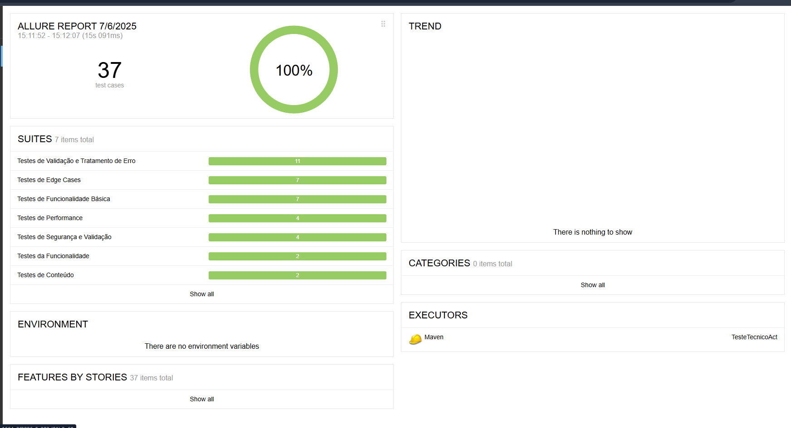

# Teste técnico da ACT


[](https://github.com/{username}/apiTestTecnicoAct/actions)
[](https://openjdk.java.net/)
[](https://maven.apache.org/)
[](https://junit.org/junit5/)
[](https://allure.qameta.io/)

Projeto de testes automatizados para a API de Cães (Dog API) desenvolvido em Java com JUnit 5, RestAssured e Allure Reports.

## 📋 Índice

- [Sobre o Projeto](#sobre-o-projeto)
- [Tecnologias Utilizadas](#tecnologias-utilizadas)
- [Estrutura do Projeto](#estrutura-do-projeto)
- [APIs Testadas](#apis-testadas)
- [Configuração](#configuração)
- [Executando os Testes](#executando-os-testes)
- [Relatórios](#relatórios)
- [Padrões de Desenvolvimento](#padrões-de-desenvolvimento)
- [Contribuição](#contribuição)

## 🎯 Sobre o Projeto

Este projeto implementa testes automatizados para a [Dog API](https://dog.ceo/dog-api/), uma API pública que fornece imagens e informações sobre diferentes raças de cães. O projeto segue as melhores práticas de testes automatizados com foco em:

- **Organização**: Estrutura hierárquica com nested classes
- **Manutenibilidade**: Uso de fixtures para dados de teste
- **Padrões Internacionais**: Código em inglês com documentação em português
- **Cobertura Completa**: Testes de funcionalidade, performance e edge cases

## 🛠 Tecnologias Utilizadas

| Tecnologia | Versão | Propósito |
|------------|--------|-----------|
| **Java** | 11+ | Linguagem principal |
| **JUnit 5** | 5.8+ | Framework de testes |
| **RestAssured** | 4.5+ | Cliente HTTP para testes de API |
| **Allure Reports** | 2.20+ | Geração de relatórios |
| **Maven** | 3.6+ | Gerenciamento de dependências |
| **SLF4J** | 1.7+ | Logging estruturado |

## 📁 Estrutura do Projeto

```
apiTestTecnicoAct/
├── src/
│   └── test/
│       ├── java/
│       │   └── com/
│       │       └── desafio/
│       │           └── act/
│       │               ├── utils/
│       │               │   ├── HttpUtils.java          # Utilitário HTTP
│       │               │   ├── Assertions.java         # Assertions customizadas
│       │               │   └── FixtureUtils.java       # Carregamento de fixtures
│       │               └── tests/
│       │                   ├── DogApiImageTest.java           # Testes de imagem aleatória
│       │                   ├── DogApiBreedImagesTest.java     # Testes de imagens por raça
│       │                   └── DogApiBreedsListTest.java      # Testes de lista de raças
│       └── resources/
│           ├── fixtures/
│           │   ├── racas.json                          # Dados de raças
│           │   └── breed-images.json                   # Dados de imagens por raça
│           ├── response/
│           │   ├── random-image-schema.json            # Schema para imagem aleatória
│           │   ├── breed-images-schema.json            # Schema para imagens por raça
│           │   └── breeds-list-schema.json             # Schema para lista de raças
│           └── test.properties                         # Configurações de teste
├── allure-results/                                     # Resultados do Allure
├── target/                                             # Arquivos compilados
└── pom.xml                                            # Configuração Maven
```

## 🚀 APIs Testadas

### 1. **GET /breeds/image/random**
- **Descrição**: Retorna uma imagem aleatória de cão
- **Classe de Teste**: `DogApiImageTest`
- **Cobertura**: Funcionalidade básica, segurança, performance, edge cases

### 2. **GET /breed/{breed}/images**
- **Descrição**: Retorna lista de imagens de uma raça específica
- **Classe de Teste**: `DogApiBreedImagesTest`
- **Cobertura**: Validação de raças, tratamento de erros, performance

### 3. **GET /breeds/list/all**
- **Descrição**: Retorna lista completa de todas as raças
- **Classe de Teste**: `DogApiBreedsListTest`
- **Cobertura**: Funcionalidade, validação de conteúdo, performance

## ⚙️ Configuração

### Pré-requisitos

- Java 17 ou superior
- Maven 3.6 ou superior

### Instalação

1. **Clone o repositório**:
```bash
git clone <url-do-repositorio>
cd apiTestTecnicoAct
```

2. **Compile o projeto**:
```bash
mvn clean compile
```

3. **Verifique as configurações**:
```properties
# src/test/resources/test.properties
base.url=https://dog.ceo/api
endpoint.lista.racas=/breeds/list/all
```

## 🧪 Executando os Testes

### Executar Todos os Testes
```bash
mvn clean test
```

### Executar Testes por Tag
```bash
# Testes de fumaça (smoke)
mvn test -Dgroups=smoke

# Testes de performance
mvn test -Dgroups=performance

# Testes de segurança
mvn test -Dgroups=seguranca
```

### Executar Classe Específica
```bash
# Testes de imagem aleatória
mvn test -Dtest=DogApiImageTest

# Testes de imagens por raça
mvn test -Dtest=DogApiBreedImagesTest

# Testes de lista de raças
mvn test -Dtest=DogApiBreedsListTest
```

## 🛠️ Como Instalar o Allure

Para visualizar os relatórios gerados localmente, é necessário instalar o Allure CLI em sua máquina.

### **Windows**
```bash
choco install allure
```
> Requer o [Chocolatey](https://chocolatey.org/install) instalado.

### **MacOS**
```bash
brew install allure
```
> Requer o [Homebrew](https://brew.sh/) instalado.

### **Linux (Ubuntu/Debian)**
```bash
sudo apt-add-repository ppa:qameta/allure
sudo apt-get update
sudo apt-get install allure
```

### **Via NPM (Alternativa multiplataforma)**
```bash
npm install -g allure-commandline --save-dev
```

### **Verificando a Instalação**
```bash
allure --version
```
Se aparecer a versão do Allure, está tudo certo!

### **Como Usar**
Após instalar, você pode abrir o relatório com:
```bash
allure serve target/allure-results
```
ou
```bash
allure open target/allure-report
```

## 📊 Relatórios

### Allure Reports
O projeto gera relatórios detalhados usando Allure Reports:

```bash
# Rodar os testes (JUnit, TestNG, etc.)
mvn clean test

# Gerar o relatório
allure generate allure-results --clean -o allure-report

# Abrir o relatório no navegador
allure open allure-report

```

### Estrutura dos Relatórios
- **Dashboard**: Visão geral dos testes
- **Suites**: Organização por classes de teste
- **Behaviors**: Agrupamento por funcionalidades
- **Timeline**: Análise temporal dos testes
- **Categories**: Classificação de falhas

## 🔄 CI/CD Pipeline

### GitHub Actions

O projeto utiliza **GitHub Actions** para **Integração Contínua (CI)**, garantindo qualidade e confiabilidade do código.

#### 🚀 **Pipeline Automatizado**

O pipeline é executado automaticamente em:
- **Push** para branches `main` e `develop`
- **Pull Requests** para `main` e `develop`

#### 📋 **Jobs do Pipeline**

| Job | Descrição | Status |
|-----|-----------|--------|
| **Test** | Executa testes funcionais | ✅ Ativo |
| **Compile** | Compila o projeto | ✅ Ativo |
| **Allure Report** | Gera relatórios visuais | ✅ Ativo |

#### 🔧 **Etapas do Pipeline**

1. **Checkout** do código
2. **Configuração** do Java 17
3. **Validação** do projeto Maven
4. **Compilação** do código
5. **Execução** dos testes
6. **Geração** do relatório Allure
7. **Upload** dos artifacts
8. **Notificação** do resultado

#### 📊 **Relatórios Gerados**

- **Allure Reports**: Relatórios visuais detalhados dos testes
- **Test Results**: Resultados de execução dos testes
- **Build Status**: Status de compilação e execução

#### 🎯 **Benefícios**

- ✅ **Automação completa** do processo de teste
- ✅ **Qualidade garantida** em cada commit
- ✅ **Relatórios automáticos** de execução
- ✅ **Feedback rápido** sobre problemas
- ✅ **Integração contínua** profissional

#### 📁 **Arquivo de Configuração**

```yaml
# .github/workflows/ci.yml
name: CI Pipeline - Testes Funcionais

on:
  push:
    branches: [ main, develop ]
  pull_request:
    branches: [ main, develop ]

jobs:
  test:
    name: Executar Testes Funcionais
    runs-on: ubuntu-latest
    # ... configurações detalhadas
```

#### 🔍 **Como Verificar**

1. **GitHub Actions Tab**: Acesse a aba "Actions" no repositório
2. **Status Badge**: Verifique o badge de status no README
3. **Artifacts**: Baixe relatórios na aba "Actions"
4. **Logs**: Analise logs detalhados de cada execução

#### 🛠 **Execução Local**

Para executar o mesmo pipeline localmente:

```bash
# Validar projeto
mvn validate

# Compilar
mvn compile

# Executar testes
mvn test

# Gerar relatório
mvn allure:report
```

## 🏗 Padrões de Desenvolvimento

### Organização dos Testes

#### 1. **Estrutura Hierárquica**
```java
@Nested
@DisplayName("Testes de Funcionalidade Básica")
class TestesFuncionalidadeBasica {
    // Testes básicos
}

@Nested
@DisplayName("Testes de Performance")
class TestesPerformance {
    // Testes de performance
}
```

#### 2. **Tags de Organização**
- `@Tag("smoke")` - Testes críticos
- `@Tag("funcionalidade")` - Testes básicos
- `@Tag("performance")` - Testes de performance
- `@Tag("seguranca")` - Testes de segurança
- `@Tag("edge-case")` - Casos extremos

### Fixtures (Dados de Teste)

#### Estrutura JSON
```json
{
  "racas_esperadas": ["husky", "labrador", "golden"],
  "racas_populares": ["labrador", "golden", "bulldog"],
  "timeout_esperado_ms": 3000
}
```

#### Uso no Código
```java
private void loadFixtures() {
    VALID_BREEDS = FixtureUtils.getListFromFixture("breed-images.json", "racas_validas");
    EXPECTED_TIMEOUT_MS = FixtureUtils.getIntegerFromFixture("breed-images.json", "timeout_esperado_ms");
}
```

### Padrões de Nomenclatura

#### Código em Inglês
- Métodos: `sendRequest()`, `validateApiContract()`
- Variáveis: `VALID_BREEDS`, `EXPECTED_TIMEOUT_MS`
- Constantes: `RANDOM_IMAGE_ENDPOINT`

#### Documentação em Português
- Comentários JavaDoc
- Mensagens de log
- @DisplayName dos testes

## 🔧 Utilitários

### HttpUtils
Utilitário centralizado para requisições HTTP:

```java
Response response = HttpUtils.sendRequest(
    HttpMethod.GET,
    "/breeds/image/random"
);
```

### Assertions
Assertions customizadas para validações específicas:

```java
Assertions.verifyEquality(expected, actual, "Mensagem de erro");
Assertions.validateApiContract(response, "schema.json");
```

### FixtureUtils
Carregamento de dados de teste:

```java
List<String> breeds = FixtureUtils.getListFromFixture("racas.json", "racas_esperadas");
```